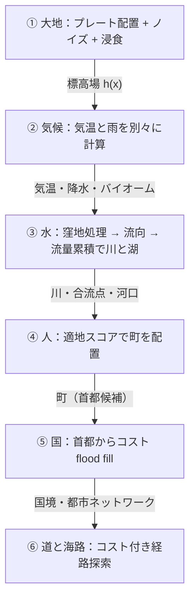
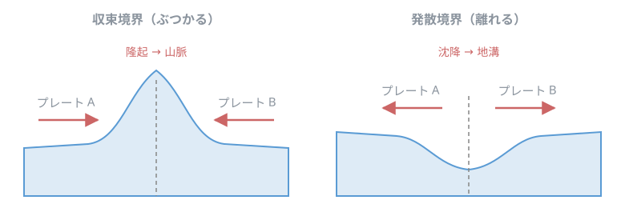
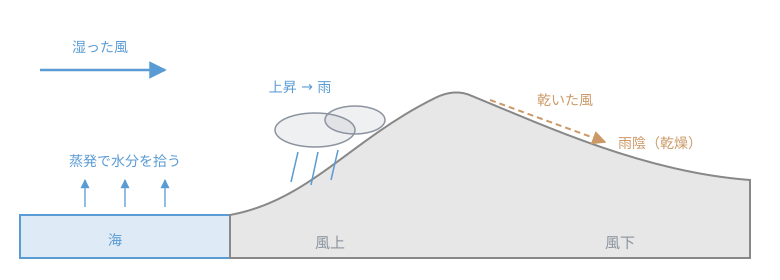
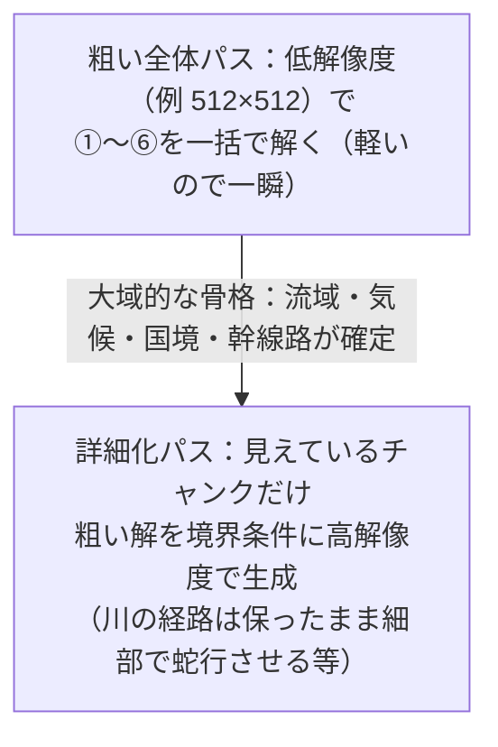

# 手続き型地図生成のパイプライン（大地→気候→水→人→国→道）

架空地図ジェネレータ USOMAP の作者解説（[Togetter まとめ](https://togetter.com/li/2727453)）にある
「世界の成り立ちを順番に計算する」方式が、どんなアルゴリズムの組み合わせで実現できるかを整理したメモ。
系譜としては Martin O'Leary の *Generating fantasy maps*、Red Blob Games のポリゴンマップ生成、
Azgaar's Fantasy Map Generator などで確立された手法群で、各段階とも既知の部品でほぼ再現できる。

このリポジトリとの関係: [height.ts](../src/algorithm/height.ts) の fBm 高さ場は「① 大地」の前半に相当する。
後半（§7）で、この種のパイプラインと遅延生成（無限地形）の相性も整理する。

> この文書は図を **Mermaid**（関係図）・数式を **LaTeX**・幾何図を **SVG** で描く。GitHub 上ではすべてそのまま描画される。
> VS Code の組込みプレビューでは LaTeX と SVG は表示されるが、**Mermaid だけは拡張**（例: "Markdown Preview Mermaid Support"）が要る。

---

## 0. 全体像 — 前の結果を次が受け取る

「絵」を一発で描くのではなく、因果の順に 6 段のパイプラインを流す。各段の出力が次の段の入力になる。

各段は単純でも、**因果の連鎖が下流に伝播する**（プレート→山→雨陰→川→町→国境→道）ので、
出来上がった地図に「説明のつく偶然」——山の風下の砂漠、川に沿う国境、峠の要衝——が自動的に埋まる。
図では線形に描いたが、実際には後段は前段までの**すべての**出力（標高・気候・川…）を参照できる。

---

## 1. 大地 — なんちゃってプレートテクトニクス

### 1-1. プレートを置き、境界の性質を決める

平面にランダムな種を数個まいて**ボロノイ分割**（またはメッシュ上の flood fill）でプレート領域を作り、
各プレートにランダムな**移動ベクトル** $\vec{v}$ を与える。隣接するプレート A・B の境界では、
相対速度を境界の法線 $\hat{n}$（A→B 向き）に射影した符号で境界の型が決まる:

$$s = (\vec{v}_A - \vec{v}_B)\cdot \hat{n}$$

- $s > 0$（近づく）: **収束境界** → 境界に沿って隆起＝**山脈**
- $s < 0$（離れる）: **発散境界** → 境界に沿って沈降＝**地溝**

隆起・沈降は境界からの距離で減衰させると、山脈が「幅」を持つ。これで「なぜここに山があるのか」に
構造的な理由がつく。

### 1-2. ベース地形と浸食

ベースの起伏は fBm（Perlin/Simplex の重ね合わせ。このリポジトリの [height.ts](../src/algorithm/height.ts) と同じ）で作り、
プレート由来の隆起・沈降を加算する。仕上げに**水力浸食**をかけて谷を掘る。定番は stream power 則:

$$\frac{\partial h}{\partial t} = U - k\,A^{m}S^{n}$$

$h$ は標高、$U$ は隆起速度、$A$ は集水面積（上流の広さ＝流量の代理）、$S$ は勾配。
経験的に $m \approx 0.5,\ n \approx 1$ がよく使われる。「たくさん水が集まる急な場所ほど削れる」ので、
谷が V 字に掘れて稜線がシャープになる。粒子（雨滴）を落として転がすシミュレーション型もよく使われる。

---

## 2. 気候 — 気温と雨は別々に計算する

### 2-1. 気温

緯度による勾配と、標高による低下（逓減率 $\Gamma \approx 6.5$ ℃/km）だけでほぼ決まる:

$$T(x) = T_{\text{sea}}(\phi) - \Gamma\, h(x)$$

$T_{\text{sea}}$ は海面気温（緯度 $\phi$ の関数）。

### 2-2. 雨 — 移流モデルと雨陰

降水は**空気塊をマップ上で風向きに行進させる**移流モデル。水分量 $M$ を持つ空気塊が、
海の上では蒸発 $E$ を拾い、地形で $\Delta h$ 持ち上げられると雨 $P$ を落とす:

$$P = k\, M\, \max(0,\ \Delta h) \qquad M \leftarrow M - P + E$$

山を越えた風下側は $M$ が尽きてカラカラになる——これが**雨陰（rain shadow）**。
風向パラメータを変えると雨陰が反対側に移る＝「砂漠が山の反対側へ引っ越す」のは、このモデルの自然な帰結。

### 2-3. バイオーム

気温×降水の 2 軸から **Whittaker ダイアグラム**で植生を引く。実装上はただの 2 次元ルックアップ表:

| | 降水 少 | 降水 中 | 降水 多 |
| --- | --- | --- | --- |
| **寒** | ツンドラ | タイガ | タイガ |
| **温** | ステップ | 草原・落葉樹林 | 温帯雨林 |
| **暑** | 砂漠 | サバンナ | 熱帯雨林 |

---

## 3. 水 — 流れの構造を掘り出す

川は描くものではなく、標高場から**導出する**もの。

1. **窪地処理**（priority-flood 等）: すべてのセルから海まで下り坂が繋がるよう窪地を埋める。埋め残しは湖にする。
2. **流向**: 各セルの流れ先を最急降下の隣接セル（D8）に決める。
3. **流量累積**: 上流から下流へ、雨（自分の分）＋上流の合計を流す:

$$F(c) = R(c) + \sum_{u \in \mathrm{up}(c)} F(u)$$

$R(c)$ はセル $c$ に降る雨（②の降水を使うと乾燥地帯の川は細くなる）、$\mathrm{up}(c)$ は $c$ に流れ込むセル。
$F$ がしきい値を超えたセル列を**川**として描く。合流点・河口・川幅（$F$ に比例）は、この構造から自動的に得られる。

---

## 4. 人 — 「住みたい場所」に町が生まれる

各セルに**適地スコア**を付けて、スコアの局所最大に町を置く。加点要素は例えば:

- 河口（川が海に出る点）・川の**合流点**——水運の結節点
- 天然の湾・岬に守られた**海沿い**——港
- 平坦・温暖・肥沃なバイオーム
- 淡水（川・湖）への近さ

既存の町から一定距離内は抑制する（ポアソンディスク的な間引き）と、団子にならず散らばる。

---

## 5. 国 — 首都から「歩きやすさ」で広がる

上位の町を首都に選び、各首都 $c_k$ から**コスト付き flood fill**（実質 Dijkstra）で領土を広げる。
各セルの帰属は「最も安く到達できた首都」:

$$\mathrm{owner}(x) = \arg\min_{k}\ d_{\mathrm{cost}}(c_k,\ x)$$

$d_{\mathrm{cost}}$ は移動コストの最短路距離で、コストを**勾配・山岳・大河の横断**で重くしておくのが肝。
コストの壁のところで拡張が止まるので、**国境が自然と山脈や大河に沿う**。
Azgaar's Fantasy Map Generator がまさにこの方式。

---

## 6. 道と海路 — 経路探索が地形を「読む」

### 6-1. 陸路

町どうしを A\*/Dijkstra で結ぶ。エッジコストの形は例えば:

$$w(e) = \ell(e)\left(1 + \alpha\, s(e)^{2}\right) + \beta\, r(e)$$

$\ell$ は距離、$s$ は勾配（2 乗で急坂を強く嫌う）、$r$ は川の横断幅。すると:

- 勾配ペナルティで経路は**谷を縫い**、等高線に沿って鞍部（峠）に集まる。
- 川の横断は幅（流量 $F$）に比例して高くつくので、**細い所で渡る＝そこが橋**になる。
- 多数の経路が同じ峠を通る。**通過量（媒介中心性）の高いノードに町を追加**すると「峠の要衝」ができる。

### 6-2. 海路

海セル上で同じ経路探索をする。「岸に近すぎると座礁（コスト大）・離れすぎも不可」のようなコスト設計に
経路の直線化（スムージング）を足すと、岸を舐めずに**岬から岬へショートカットする**航路になる。

---

## 7. 「一度に全部」はどこまで必須か — 依存の射程

このパイプラインを見ると全マップ一括生成が必須に思えるが、実際は**段階ごとに「どこまで遠くに依存するか」**が違う。

### 7-1. 有限の一枚地図なら一括が素直

USOMAP や Azgaar のような「一枚の地図を出力するツール」は、固定解像度のグリッド（or 数千〜数万セルのメッシュ）に
全段階を一括で流す。このサイズなら計算量もメモリも軽く、分割生成を頑張る動機がない。

### 7-2. 依存の射程で 3 分類

チャンク分割・遅延生成（Minecraft 的な無限世界）をしたくなったときに効くのがこの分類:

| 射程 | 段階 | 理由 |
| --- | --- | --- |
| **局所**（その場で計算可） | ベースノイズ・気温・プレート帰属 | fBm は座標の純関数。ボロノイも種を決定的ハッシュで作れば任意の点で単独計算できる |
| **有界**（近傍があれば可） | 雨（移流）・浸食・町の配置 | 湿気は風上へ有限距離で減衰し尽きるので「風上に一定距離ぶんの地形」で足りる。チャンク＋のりしろ（halo）で生成できる |
| **大域**（全体が要る） | 流量累積・窪地処理・国境・長距離の道 | 川の一点の水量は**上流の流域全体**に依存する（射程が非有界）。国境は遠くの首都からの最短コスト路の結果 |

つまり本当に「一度に」が必要なのは、**流れ（水）と到達可能性（国・道）を扱う段階だけ**。

Minecraft が無限世界を実現できているのは、川を流量計算ではなくノイズの帯で描き、気候も移流ではなく
ノイズ場で決めている——つまり**大域段階を局所近似に差し替えて、因果の「噛み合い」を捨てている**から。
砂漠が山の風下に来ない世界になる、というのがその代償。

### 7-3. 両取りの定石 — 多重解像度

大域的な一貫性と遅延生成を両立させる常套手段:

Dwarf Fortress がこの実例で、ワールド生成時に河川や歴史まで粗く全体を解き、入植地点だけローカルに精細化する。

### 7-4. このリポジトリの現在地

- [height.ts](../src/algorithm/height.ts) の fBm 高さ場は表の**局所**に属する。
  [quadtree-lod.md](quadtree-lod.md) の LOD（任意の位置・細かさで `height()` を引ける前提）が成り立つのは、この局所性のおかげ。
- もし浸食や河川を足すなら**有界〜大域**への一歩目。まずは固定サイズのグリッドへの一括シミュレーションとして
  書くのが素直で、無限地形との両立（多重解像度化）はその先の課題として切り分ける。

---

## 参考

- Martin O'Leary, ["Generating fantasy maps"](https://mewo2.com/notes/terrain/) — 隆起＋浸食→都市→国境→ラベルの一枚地図パイプライン
- Amit Patel (Red Blob Games), ["Polygonal Map Generation for Games"](http://www-cs-students.stanford.edu/~amitp/game-programming/polygon-map-generation/) / [mapgen4](https://www.redblobgames.com/maps/mapgen4/) — ボロノイメッシュ・降水・河川の実装解説
- [Azgaar's Fantasy Map Generator](https://azgaar.github.io/Fantasy-Map-Generator/) — 本文⑤のコスト flood fill 方式の実装（オープンソース）
- Dwarf Fortress の world generation — §7-3 多重解像度（全体を粗く解いてから局所精細化）の実例
- USOMAP 作者解説: [Togetter まとめ](https://togetter.com/li/2727453)（この文書の出発点）
- 関連メモ: [gradient-vectors.md](gradient-vectors.md)・[random-access-prng.md](random-access-prng.md)（①のノイズの部品）,
  [quadtree-lod.md](quadtree-lod.md)（局所性を前提にした遅延評価・描画側の多重解像度）
